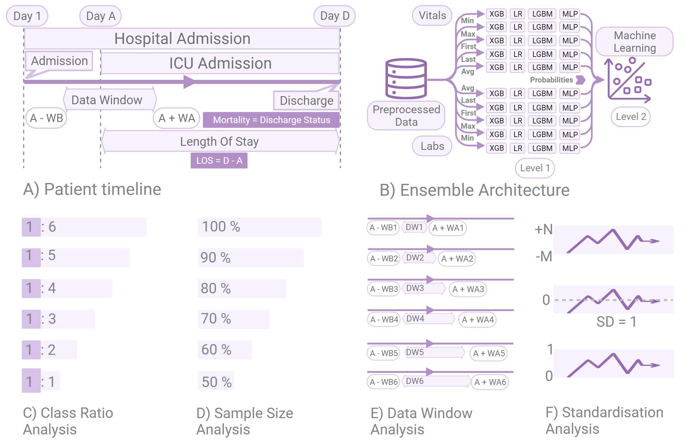

EHR-ML
======

**EHR-ML empowers predictive modeling in healthcare, offering a comprehensive suite of tools designed to unlock the full potential of electronic health records (EHRs). It streamlines the process of building accurate and reliable models for various clinical outcomes, addressing unique challenges within healthcare data.**

**Key features:**

- **Optimization guidance:** Provides four essential analyses to determine the optimal setup for specific clinical outcomes:
    - Time-Window Analysis
    - Sample-Size Analysis
    - Standardisation Analysis
    - Class-Ratio Analysis

- **Dedicated prediction utilities:** Offers pre-built tools for predicting two crucial outcomes:
    - EHR2Mortality
    - EHR2LOS

- **Generic prediction utility:** Additionally, it also offers a generic utility for building predictive models for any clinical outcome present in the EHR.

- **Customizable model:** Includes a custom-built model specifically designed to handle the intricacies of time-varying signals in healthcare data.

- **User-friendly interfaces:** Choose between a command-line interface (CLI) for those with basic Linux skills or an intuitive web portal, both providing full functionality.

**EHR-ML bridges the gap between complex healthcare data and actionable insights, enabling researchers and clinicians to make informed decisions and improve patient care.**

.. note::

   This project is under active development.

.. topic:: Acknowledgements

   .. image:: images/monash.png
      :width: 20 %

   .. image:: images/alfred.png
      :width: 20 %

   .. image:: images/superbugai.png
      :width: 20 %

   .. image:: images/RMIT_University_Logo.png
      :width: 20 %

Contents
--------

.. toctree::
   :maxdepth: 1

   command_line
   web_portal

