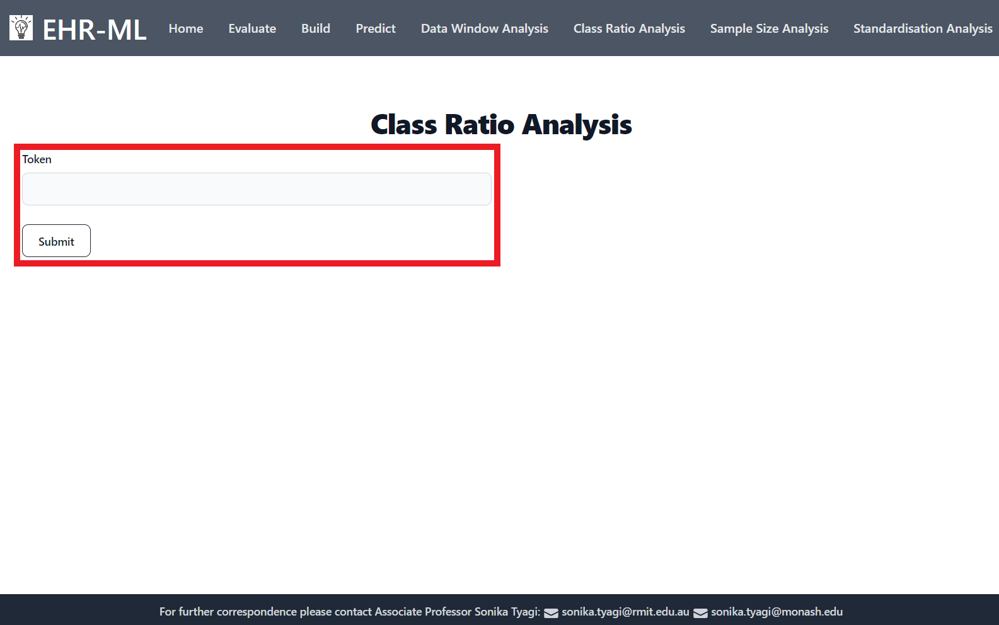

Web Portal
==========

The EHR-ML is now accessible via a web-based interface through a dedicated web-portal.

**Get started by visiting the below URL**

http://118.138.239.87/

After loading the URL, the `Homepage` appears;

Download sample data
--------------------

**See how EHR-ML works!**

Download a sample input file to learn its format and dive right in. Click `Start` on the `Homepage`, then `Download` on the `Data Management` page.

.. image:: images/ehr_ml_web/data_management_download.png

Upload data files
-----------------

**Let's upload your data!**

Make sure your files match the format (sample file provided). Click "Start" on the `Homepage`, then "Upload" on the "Data Management" page.

Every successful upload generates a unique token, which acts as an identifier for your data in subsequent analyses. Please keep this token safe and readily available.

.. image:: images/ehr_ml_web/data_management_upload_token.png

Evaluate
--------

**Evaluate your prediction model's performance with ease!**

**Grab your token**: Enter the token associated with your uploaded data. (Remember, this token acts as your key to access your data.)

**Dive deeper**: On the next page, provide additional details about your model.

**Click and analyze**: Hit "Submit" and relax! You can revisit this page anytime to download the results.

.. image:: images/ehr_ml_web/evaluate_main_page.PNG

**Output**:

A JSON file containing the performance metricies including Fit Time, Score Time, Accuracy, Balanced Accuracy, Average Precision, F1, ROC AUC, and MCCF1 scores.

With this information, you can make informed decisions about your model's effectiveness and optimize it for better performance.

Build
-----

**Build an ensemble model with your data!**

This tool lets you create a robust ensemble machine learning model based on your uploaded data. It combines the strengths of multiple algorithms for improved accuracy and reliability.

**Grab your token**: Enter the token associated with your uploaded data. (Remember, this token acts as your key to access your data.)

.. image:: images/ehr_ml_web/build_token_page.PNG

**Dive deeper**: On the next page, provide additional details about your model.

**Click and analyze**: Hit "Submit" and relax! You can revisit this page anytime to download the results.

**Output**:

A pickle file containing your trained ensemble model.

Use this model to make predictions on new, unseen data anytime!

Predict
-------

**Make Predictions with Your Model!**

This tool lets you use your previously built model to analyze new, unseen data.

**Grab your token**: Enter the token for your uploaded data (used for training and testing). Additionally, provide the token for your specific model (think of it as your model's unique ID).

.. image:: images/ehr_ml_web/predict_token_page.PNG

**Dive deeper**: On the next page, provide details about what you want to predict.

**Click and analyze**: Hit "Submit" and relax! You can revisit this page anytime to download the results.

.. image:: images/ehr_ml_web/predict_main_page.PNG

**Output**:

A csv file with predictions for every row of your uploaded data.

Data Window Analysis
--------------------

**Uncover Data Window Impact on Model's Performance!**

This powerful tool helps you understand how different data time windows affect your prediction model's accuracy.

**Standalone or Ensemble? Your Choice!**

You have the flexibility to run this analysis with either a standalone or ensemble model.

**Grab your token**: Enter the token associated with your uploaded data. (Remember, this token acts as your key to access your data.)

.. image:: images/ehr_ml_web/dwa_token_page.PNG

**Dive deeper**: On the next page, provide additional details about the analysis.

**Click and analyze**: Hit "Submit" and relax! You can revisit this page anytime to download the results.

**Output**:

A JSON file containing the performance metricies including Fit Time, Score Time, Accuracy, Balanced Accuracy, Average Precision, F1, ROC AUC, and MCCF1 scores.

This data helps you analyze the impact of different time windows on your model's effectiveness and choose the best option for your specific needs.

Class Ratio Analysis
--------------------

**Uncover Class Ratio Impact on Model's Performance!**

This powerful tool helps you understand how different class ratio affect your prediction model's accuracy.

**Standalone or Ensemble? Your Choice!**

You have the flexibility to run this analysis with either a standalone or ensemble model.

**Grab your token**: Enter the token associated with your uploaded data. (Remember, this token acts as your key to access your data.)

**Dive deeper**: On the next page, provide additional details about the analysis.

**Click and analyze**: Hit "Submit" and relax! You can revisit this page anytime to download the results.

**Output**:

A JSON file containing the performance metricies including Fit Time, Score Time, Accuracy, Balanced Accuracy, Average Precision, F1, ROC AUC, and MCCF1 scores.

This data helps you analyze the impact of different class ratio on your model's effectiveness and choose the best option for your specific needs.

Sample Size Analysis
--------------------

**Uncover Sample Size Impact on Model's Performance!**

This powerful tool helps you understand how different sample size affect your prediction model's accuracy.

**Standalone or Ensemble? Your Choice!**

You have the flexibility to run this analysis with either a standalone or ensemble model.

**Grab your token**: Enter the token associated with your uploaded data. (Remember, this token acts as your key to access your data.)

**Dive deeper**: On the next page, provide additional details about the analysis.

**Click and analyze**: Hit "Submit" and relax! You can revisit this page anytime to download the results.

**Output**:

A JSON file containing the performance metricies including Fit Time, Score Time, Accuracy, Balanced Accuracy, Average Precision, F1, ROC AUC, and MCCF1 scores.

This data helps you analyze the impact of different sample size on your model's effectiveness and choose the best option for your specific needs.

Standardisation Analysis
------------------------

**Uncover Standardisation Impact on Model's Performance!**

This powerful tool helps you understand how different standardisation affect your prediction model's accuracy.

**Standalone or Ensemble? Your Choice!**

You have the flexibility to run this analysis with either a standalone or ensemble model.

**Grab your token**: Enter the token associated with your uploaded data. (Remember, this token acts as your key to access your data.)

**Dive deeper**: On the next page, provide additional details about the analysis.

**Click and analyze**: Hit "Submit" and relax! You can revisit this page anytime to download the results.

**Output**:

A JSON file containing the performance metricies including Fit Time, Score Time, Accuracy, Balanced Accuracy, Average Precision, F1, ROC AUC, and MCCF1 scores.

This data helps you analyze the impact of different standardisation on your model's effectiveness and choose the best option for your specific needs.
